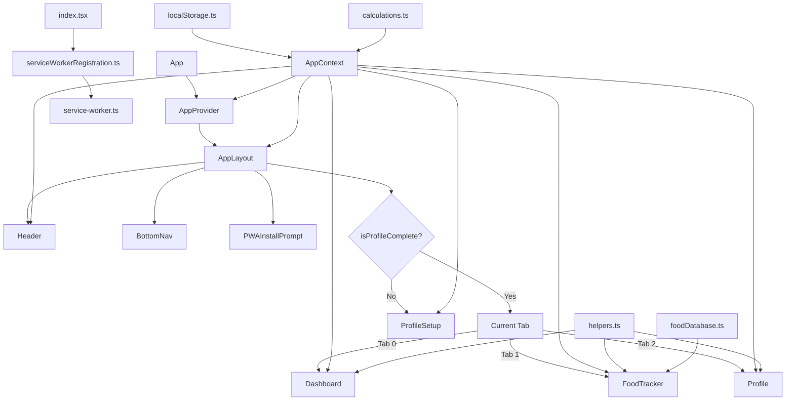
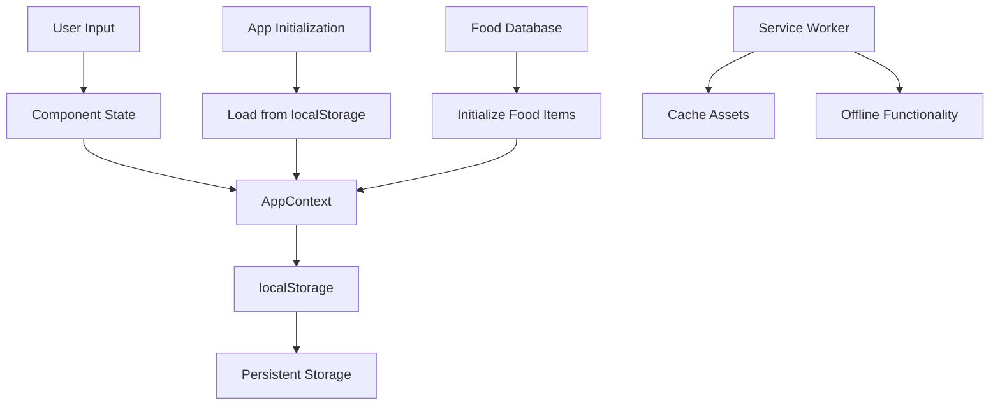
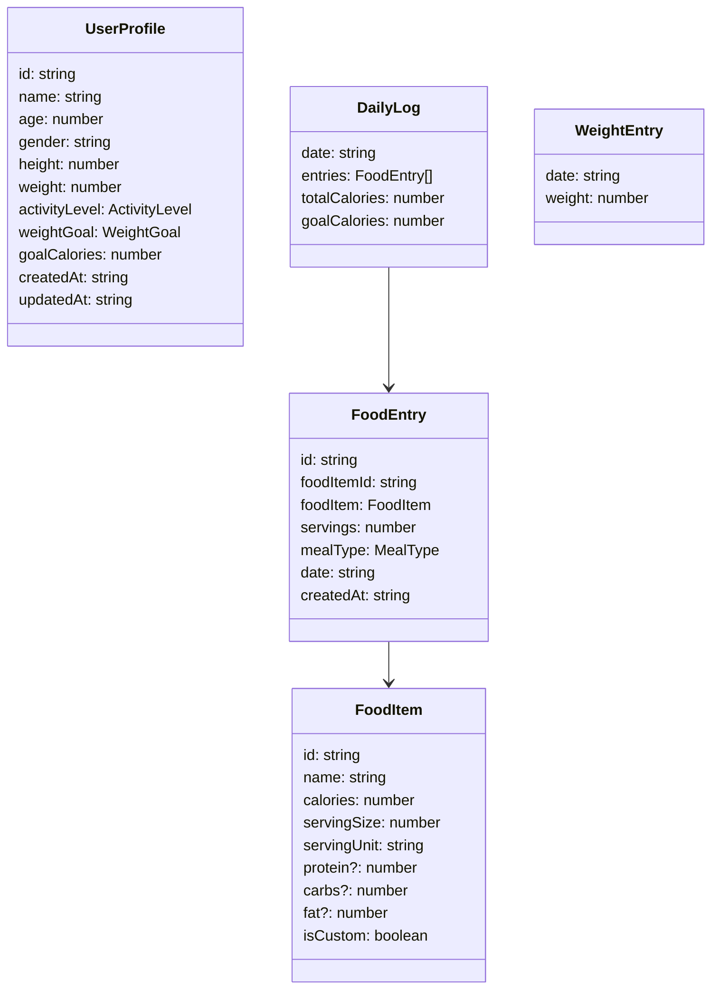
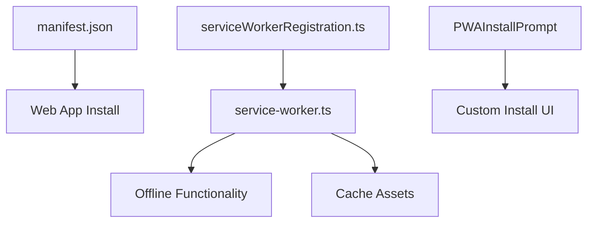

# BurnTrack Architecture

## Component Structure

```mermaid
graph TD
    A[App] --> B[AppProvider]
    B --> C[AppLayout]
    C --> D[Header]
    C --> E[BottomNav]
    C --> F[PWAInstallPrompt]
    C --> G{isProfileComplete?}
    G -->|Yes| H[Current Tab]
    G -->|No| I[ProfileSetup]
    H -->|Tab 0| J[Dashboard]
    H -->|Tab 1| K[FoodTracker]
    H -->|Tab 2| L[Profile]
    
    %% Data Flow
    M[AppContext] --> B
    M --> C
    M --> D
    M --> I
    M --> J
    M --> K
    M --> L
    
    %% Utils
    N[localStorage.ts] --> M
    O[calculations.ts] --> M
    P[helpers.ts] --> J
    P --> K
    P --> L
    Q[foodDatabase.ts] --> K
    
    %% Service Worker
    R[index.tsx] --> S[serviceWorkerRegistration.ts]
    S --> T[service-worker.ts]
```

## Data Flow

```mermaid
flowchart TD
    A[User Input] --> B[Component State]
    B --> C[AppContext]
    C --> D[localStorage]
    D --> E[Persistent Storage]
    
    F[App Initialization] --> G[Load from localStorage]
    G --> C
    
    H[Food Database] --> I[Initialize Food Items]
    I --> C
    
    J[Service Worker] --> K[Cache Assets]
    J --> L[Offline Functionality]
```

## Type Hierarchy

```mermaid
classDiagram
    class UserProfile {
        id: string
        name: string
        age: number
        gender: string
        height: number
        weight: number
        activityLevel: ActivityLevel
        weightGoal: WeightGoal
        goalCalories: number
        createdAt: string
        updatedAt: string
    }
    
    class FoodItem {
        id: string
        name: string
        calories: number
        servingSize: number
        servingUnit: string
        protein?: number
        carbs?: number
        fat?: number
        isCustom: boolean
    }
    
    class FoodEntry {
        id: string
        foodItemId: string
        foodItem: FoodItem
        servings: number
        mealType: MealType
        date: string
        createdAt: string
    }
    
    class DailyLog {
        date: string
        entries: FoodEntry[]
        totalCalories: number
        goalCalories: number
    }
    
    class WeightEntry {
        date: string
        weight: number
    }
    
    FoodEntry --> FoodItem
    DailyLog --> FoodEntry
```

## PWA Features

```mermaid
flowchart TD
    A[manifest.json] --> B[Web App Install]
    C[service-worker.ts] --> D[Offline Functionality]
    C --> E[Cache Assets]
    F[PWAInstallPrompt] --> G[Custom Install UI]
    H[serviceWorkerRegistration.ts] --> C
``` 